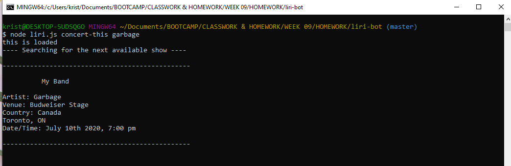
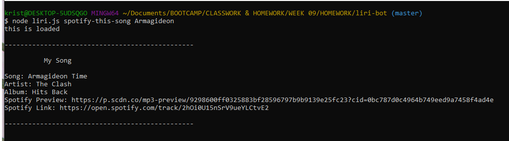
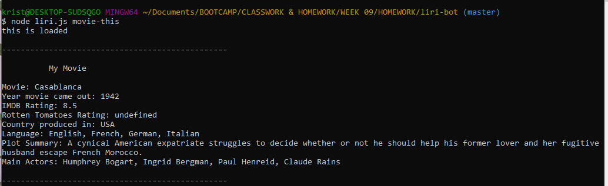
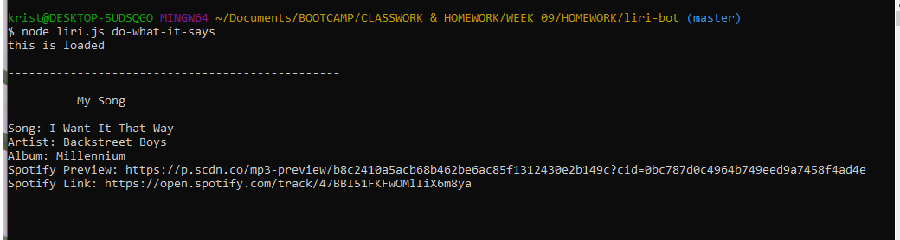

# Liri-Bot
## created by Krista Clarke (github - loraxgirl) ##
Language Interpretation and Recognition Interface

## Assignment Details
UCLA Full-stack Web Development Bootcamp - Week 09 Homework - Tasked with the problem of creating a LIRI-Bot. Similar to Apple's SIRI, Speech Interpretation and Recognition Interface. LIRI take commands via the command line, rather than using voice recognition to interpret the data.

**LIRI will search Spotify for songs, Bands in Town for concerts, and OMDB for movies.**

## Commands
+ `concert-this artist-name` - finds upcoming event for artist (if one exists)
+ `spotify-this-song song-name` - finds artist & album info for a song, as well as Spotify links
+ `movie-this movie-name` - finds plot summary, main actors, languages, ratings & location for a movie
+ `do-what-it-says` - pulls spotify data for a song in a random text file (boy band song chosen by instructor!)

### Technologies Used
* JavaScript
  * Node.js
    * Moment.js
    * Node-Spotify-API
    * Axios
    * DotEnv

* APIs
  * Spotify
  * OMDB
  * Bands In Town

### Summary
+ First time creating a git-ignore file.
+ First time creating Json packages. 
+ First time hiding API keys in a separate file. 

Used multiple Node.js modules to pull data from 3 different APIs. 
Set defaults for concert-this (Garbage), spotify-this-song (Ace of Base 'The Sign') and movie-this (Casablanca) if no user input.

### Screenshots Of The App In Action
**_concert-this_** command

**_spotify-this-song_** command

**_movie-this_** command

**_do-what-it-says_** command

### Future Enhancements
This could be served on a website, giving more user accessibility and functionality.
Could change parameters to produce more than one response for a movie or song name.
